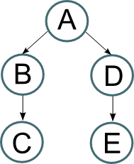
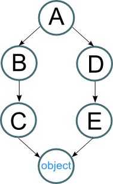
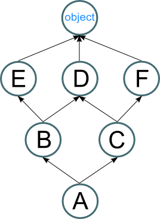
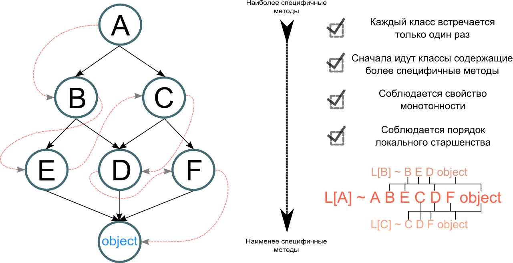

#Method Resolution Order

В этой небольшой заметке я разберу алгоритм MRO C3, который используеться в Python, для получения устойчивой линеаризации иерархии множественного наследования (начиная с версии 2.3).

**C3 superclass linearization** - это алгоритм используемый для получения устойчивой линеаризации иерархии множественного наследования в объектно-ориентированном программировании, данный алгоритм был выбран как алгоритм по умолчанию для разрешения методов в языке программирования Python 2.3 (и последующих версиях), Perl 6 и виртуальной машине Parrot.

Иными словами данный алгоритм определяет порядок в котором наследуются методы.

###Суть проблемы

Допустим у нас есть следующая модель наследования классов:  


В данном случае, если мы вызовем какой либо метод экземпляра класса **А** поиск произойдет предельно просто: **`A` → `B → C` → `D → E`**. Иными словами сначала поиск сначала происходит в экземпляре класса, в первом предке и его предках, во втором предке и его предках и т.д...

Главная проблема заключаеться в том, что начиная с версии 2.3 была добавлена возможность наследоваться от базового класса **`object`**, а начиная с версии 3.0 данный класс стал обязятельным. Были введены такие понятия как *new-style classes* и *old-style classes*:

Начиная с версии 2.3
```python
class A: pass           #old-style
class A(object): pass   #new-style
```

Начиная с версии 3.0
```python
class A: pass           #new-style по умолчанию наследуется от object
class A(object): pass   #new-style
```

Если отобразить приведенную выше модель наследования в new-style classes, выйдет следующее:  


Что порождает проблему ромбовидной структуры *"diamond diagram"*, если применить к данной структуре алгоритм, используемый ранее, выйдет следующее: **`A` → `B → C → object` → `D → E`**. Про наследование с большой определенностью можно сказать одно - чем больше глубина наследования тем меньшей спецефичностью облидают методы. Вот пример: что делать если нам необходим метод `__sizeof__` определенный в классе **`E`** но по положенной схеме отработает менее спецефичная версия метода принадлежащая классу **`object`**, либо другому базовуму классу, это порождает большое количество неудобств в общей модели наследования. Решение подобного рода проблем и являеться главной задачей **C3-линеаризации**.

Что у нас есть:
- Класс
- Список предков
- Список связей между предками

Что нам нужно получить:
- Линейный список классов по которым будет осуществяться поиск методов
- Линеаризаия должна быть **монотонной**
- Классы содержащие более спецефичные методы должны идти ранее базовых классов с менее спецефичными методами
- Каждый класс должен содержаться в конечном списке линеаризации ровно один раз

**Монотонность** - это одно главное свойство, которым должна обладать линеаризация, если **`B`** предшествует **`C`** в линеаризации **`A`**, тогда **`B`** предшествует **`C`** в линеаризации производного от **`A`** класса (если **`A → B → C`**, тогда **`O → A → B → C`**)

Разложим приведенный выше пример, соблюдая данное свойство:
- **`A → B → C → D → E → Object`**
- **`A → D → E → B → C → Object`**

У нас получилось 2 возможных комбинации, по вполне очивидным причинам, перебор осуществляеться слева → направо (1й вариант), т.е. если мы имеем **`A(B, C)`** в обработку сначала пойдет класс **`B`**, а уже потом  **`С`**. Это называеться **local precedence ordering** (порядок локального старшенства).

##Алгоритм линеаризации

Для начала введем несколько условных обозначений:
* **`C`** - класс для которого проводиться линеаризация
* **`L[C]`** - линеаризация класса **`C`**
* **`сX`** - один из классов-предков
* **`c1 c2 .. cN`** - упорядоченный список классов
* **`[С] + (c1 c2 .. cN)`** - cумма списков
* **`HEAD`** - первый элемент списка
* **`BODY`** - все кроме первого элемента
* **`merge___(L[c0] .. L[cx], c0 .. cx)`** - обьединение элементов линеаризации

Линеаризация класса **`C`** - сумма класса **`С`** и **merge___** от линеаризаций каждого из родительских классов и списка родительских классов:

**`L[ C(с1 с2 ... сN) ] = C + merge___(L[с1], L[с2], ..., L[сN], с1 с2 ... сN)`**


**Формальный вариант алгоритма marge:**
* Берем *HEAD* первого списка из **merge___**
    - Если данный элемент не входит в *BODY* любого другого списка в **merge___**, тогда удаляем его из всех списков в **marge**, добавляем его к конечному списку линеаризации
      - Если мы удалили последний элемент из списка удаляем список из **marge**
    - Иначе переходим к следующему списку
* Повторяем до того момента пока не будет удален последний список, тогда линеаризация закончена
* Если в **marge** остались еще не удаленные списки и не удается удалить ни одного *HEAD*-а, тогда линеаризация не возможна

*Стоит заметить, что условие `...не входит в BODY любого другого списка в merge___...` обусловлено тем, что если текущий HEAD входит в любой из BODY других списков это значит, что текущий HEAD являеться чьим-то предком и если его добавить в конечный список линеаризации будет нарушено условие монотонности. Также следует обратить внимание что каждую иттерацию мы начинаем всегда с первого списка в marge.*

**ПРИМЕР №1**  
Рассмотрим тривиальный вариант:  


1. Переписываем в нужной форме:  
    `L[B(object)] = [B] + merge___(L[object], [object])`
2. Находим `L[Object]` (вырожденный случай):  
    `L[object] = [object]`  
3. Подставляем:  
    `L[B(object)] = [B] + merge___([object], [object])`
4. Берем *HEAD* 1го элемента из merge___, его ни в одном из *BODY* других списков => удаляем его изо всех списков **magre**, выносим в конечный список:
    `L[B(object)] = [B] + [object] + merge___()`
5. **Marge** пуст, линеаризация закончена:  
    `L[B(object)] = [B] + [object]`  

**Пример №2**  
Менее тривиальный вариант:  


1. Записываем `L[A]`:  
    `L[ A(B,C) ] = [A] + marge(L[B], L[C], [B, C])`  
2. Находим тревиальные случаи:  
    `#уже разобранный вырожденный случай`  
    `L[object] = [object]`  
    `#находим L[E], L[D], L[F]`  
    `L[E(object)] = [E] + marge([object], [object]) = [E] + [object] = [E, object]`  
    `L[D(object)] = [D, object]`  
    `L[E(object)] = [F, object]`  
3. Находим `L[B]`:  
    `L[B(E, D)] = [B] + marge(L[E], L[D], [E, D]) =`  
    `[B] + marge([E, object], [D, object], [E, D]) =`  
    `[B] + [E] + marge([object], [D, object], [D]) =`  
    `#HEAD = object, object есть в BODY [D, object] => переходим к следующему`  
    `[B] + [E, D] + marge([object], [object]) =`  
    `[B] + [E, D, object] + marge() =`  
    `#marge пуст => линеаризация окончена`   
    `[B, E, D, object]`  
4. Аналогично `L[C]`:  
    `L[C(D, F)] = [C, D, F, object]`    
5. Разворачиваем `L[A]`:  
    `L[ A(B,C) ] = [A] + marge(L[B], L[C], [B, C]) =`  
    `[A] + marge([B, E, D, object], [C, D, F, object], [B, C]) =`  
    `[A] + [B] + marge([E, D, object], [C, D, F, object], [C]) =`  
    `[A] + [B, E] + marge([D, object], [C, D, F, object], [C]) =`  
    `[A] + [B, E, C] + marge([D, object], [D, F, object]) =`  
    `[A] + [B, E, C, D] + marge([object], [F, object]) =`  
    `[A] + [B, E, C, D, F] + marge([object], [object]) =`  
    `[A] + [B, E, C, D, F, object] + marge() =`  
    `[A, B, E, C, D, F, object]`  

Результат:


